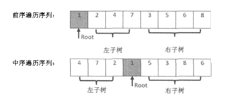

## 二叉树
---
### 1 树的概述
**定义**：树是一个或者多个节点的有效结合，其集中：
- 存在一个称为根的特定节点
- 用递归的方式看，其余的节点被分成n个互不相交的集合T,其中每个集合都是一棵树，称为子树。(二叉树即是包含两个左右子树，左右子树均为一棵二叉树)
- 树种有几个特定度量方式：
  - **节点的度**：表示节点有多少个子节点也成为了节点的子树数目，二叉树的节点的度都是$degree \le 2$
  - **树的度**：所有节点当中，度最高的一个（比如二叉树节点的最大度为2）
  - **叶子节点**：即度为0的节点
  - **层(level)**:根节点的层次为1，根节点的孩子依次类推
  - **树的高度或者深度**：表示树中的最大节点层

### 2 二叉树
1.**定义**：二叉树(binary)是有限多个节点的集合，这个集合可以是空集，或者是有一个根节点和两个互不相交的左子树和右子树组成
2. python数据结构定义
```python
class Node:
  def __init__(self, data):
    self.value = data
    self.left_tree = None
    self.right_tree = None
```
3. 四种遍历方式
**二叉树**
```python
                     10
                 /       \
                6         14
              /   \     /    \
             4     8    12    16
```
**按照父节点的和左右子节点的排列顺序分为**：
- 中序遍历: 先访问左子节点，再访问根节点，最后访问右子节点，上图中中序遍历结果： 4 6 8 10 12 14 16
- 前序遍历: 先访问根节点，再访问左子节点，最后访问右子节点，上图中前序遍历结果： 10 6 4 8 14 12 16 
- 后续遍历: 先访问左子节点，再访问右子节点，最后访问根节点，上图中后序遍历结果： 4 8 6 12 16 14 10
- 层次遍历（宽度优先遍历）： 先访问第一层节点，再访问树的第二层节点。。。。一直访问最后一层节点： 10 6 14 4 8 12 16

**递归的方法实现**（需要耗费较大的空间资源）,优化的方法使用堆栈作为数据存储结构进行处理，空间复杂度会大大降低

### **面试中经常遇到关于二叉树的题目**
- **二叉树的深度**
- **数的子结构**
- **二叉树中和为某一个值的路径**
- **重建二叉树**
- **二叉树的后序遍历**
- **从上到下遍历二叉树**
- **二叉树搜索树： 树种两个节点的最低公共祖先**
- **二叉树搜索树与双向链表**
- **堆： 大顶堆，小顶堆**
- **红黑树**
  - 红黑树把树种的节点定义为红黑两种颜色，并通过规则确保从根节点到叶节点的最长路径的长度不超过最短路径的两倍
  - C++的STL中， set，multiset, map, multimap等数据结构都是基于红黑树红丝线
- 关于堆和红黑树的面试题： **求最小K个数字**

### 各种面试题的代码实现
#### 递归方法实现二叉树的四种遍历方式
```python
from typing import List
from queue import Queue

class BinaryTree:
  '''
  当前class中的方法使用递归的方法
  将二叉树上的节点按照遍历的算法输出的数组中
  '''
  def __init__(self):
    self.result_list = None
  
  def init_result(self):
    self.result_list = []
  
  def print_result_list(self, message: str = None) -> None:
    print(message)
    print(self.result_list)

  def in_order(self, node: Node) -> List:
    '''
    中序遍历, 需要保存到数组里，使用前请调用self.init_result() function
    '''
    if not node:  # 节点为Null，直接return
      return
    self.in_order(node.left_tree)
    self.result_list.append(node.value)
    self.in_order(node.right_tree)
    return self.result_list

  def pre_order(self, node: Node) -> List:
    '''
    前序遍历， 需要保存到数组里，使用前请调用self.init_result() function
    :param node: 要前序遍历的node
    :return:  
    '''
    if not node:
      return
    self.result_list.append(node.value)
    self.pre_order(node.left_tree)
    self.pre_order(node.right_tree)
    return self.result_list

  def post_order(self, node: Node) -> List:
    '''
    后续遍历， 需要保存到数组里，使用前请调用self.init_result() function
    '''
    if not node:
      return
    self.post_order(node.left_tree)
    self.post_order(node.right_tree)
    self.result_list.append(node.value)
    return self.result_list

  def level_order(self, node: Node) -> List[int]:
    '''
    层次遍历，需要保存到数组里，该方法内部已经调用self.init_result()， 无需外部调用
    使用队列的数据结构，将节点放到队列中，先进先出
    '''
    self.init_result()
    if not node:
        return None
    q = Queue()  # 使用队列对树进行层次遍历
    q.put(node)  # first add root node
    while q.qsize() != 0:
        get_node = q.get()  # type: Node
        self.result_list.append(get_node.value)
        if get_node.left_tree:
            q.put(get_node.left_tree)
        if get_node.right_tree:
            q.put(get_node.right_tree)
    return self.result_list
    
  
if __name__ == "__main__":
    node_leaf_4 = Node(4)
    node_leaf_8 = Node(8)
    node_leaf_12 = Node(12)
    node_leaf_16 = Node(16)

    node_6 = Node(6)
    node_6.left_tree = node_leaf_4
    node_6.right_tree = node_leaf_8

    node_14 = Node(14)
    node_14.left_tree = node_leaf_12
    node_14.right_tree = node_leaf_16

    node_root = Node(10)
    node_root.left_tree = node_6
    node_root.right_tree = node_14

    bt = BinaryTree()
    bt.init_result()
    pre_order_list = bt.pre_order(node_root)
    print(pre_order_list)
    bt.init_result()
    in_order_list = bt.in_order(node_root)
    print(in_order_list)
    bt.init_result()
    post_order_list = bt.post_order(node_root)
    print(post_order_list)
    level_order_list = bt.level_order(node_root)
    print(level_order_list)

'''
pre_order_list:   [10, 6, 4, 8, 14, 12, 16]
in_order_list:    [4, 6, 8, 10, 12, 14, 16]
post_order_list:  [4, 8, 6, 12, 16, 14, 10]
level_order_list: [10, 6, 14, 4, 8, 12, 16]
'''
```
#### 循环方法实现二叉树的四种遍历方式（使用堆栈数据结构）
```python
class BinaryTreeOptimization:
    """
    基于堆栈的方法对二叉树进行遍历，算法进一步会优化
    """
    @staticmethod
    def in_order(node: Node) -> List[int]:
        """
        借助队列和队列，对二叉树进行中序遍历
        :param node:
        :return:
        """
        if node is None:  # None，直接return
            return []

        result = []
        stack = []
        pos = node
        while pos is not None or len(stack) > 0:
            if pos is not None:
                stack.append(pos)
                pos = pos.left_tree
            else:
                pos = stack.pop()
                result.append(pos.value)
                pos = pos.right_tree

        return result

    @staticmethod
    def pre_order(node: Node) -> List[int]:
        """
        借助队列和队列，对二叉树进行中序遍历,前序遍历
        :param node:
        :return:
        """
        if not node:  # 节点为None，直接return
            return []

        result = []
        s = Stack()
        s.push(node)
        while s.is_empty() is not True:
            get_node = s.pop()  # type: Node
            result.append(get_node.value)
            if get_node.right_tree:  # 先将右子树压栈
                s.push(get_node.right_tree)
            if get_node.left_tree:
                s.push(get_node.left_tree)
        return result

    def post_order(self, node: Node) -> List[int]:
        """
        # 后序打印二叉树（非递归）
        # 使用两个栈结构
        # 第一个栈进栈顺序：左节点->右节点->跟节点
        # 第一个栈弹出顺序： 跟节点->右节点->左节点(先序遍历栈弹出顺序：跟->左->右)
        # 第二个栈存储为第一个栈的每个弹出依次进栈
        # 最后第二个栈依次出栈
        :param node:
        :return:
        """
        if not node:
            return []
        result = []
        stack = [node]
        stack2 = []
        while len(stack) > 0:
            node = stack.pop()
            stack2.append(node)
            if node.left_tree is not None:
                stack.append(node.left_tree)
            if node.right_tree is not None:
                stack.append(node.right_tree)
        while len(stack2) > 0:
            result.append(stack2.pop().value)
        return result
```
#### 重建二叉树
- 题目： 输入某二叉树的前序遍历和中序遍历的结果，请重建该二叉树；假设输入的前序遍历和中序遍历的结果中都不包含重复的数字。例如：输入前序序列为 {1, 2, 4, 7, 3, 5, 6,8}和中序遍历 {4, 7 ,2, 1, 5 ,3, 8 ,6}，请重建该二叉树
- 题解：
  - 在二叉树的前序遍历中，第一个数字为根节点。但是在中序遍历中，根节点在序列的中间，左子树的节点位于根节点的左侧，而右子树的节点位于根节点的右边。因此我们需要扫描中序遍历才能找到根节点的值。
```python
'''
           1
        /     \
      2        3
    /        /    \
  4         5      6
    \             /  
    7             8
'''
```
寻找根节点和左右子树

- **实现代码**
```python

```


